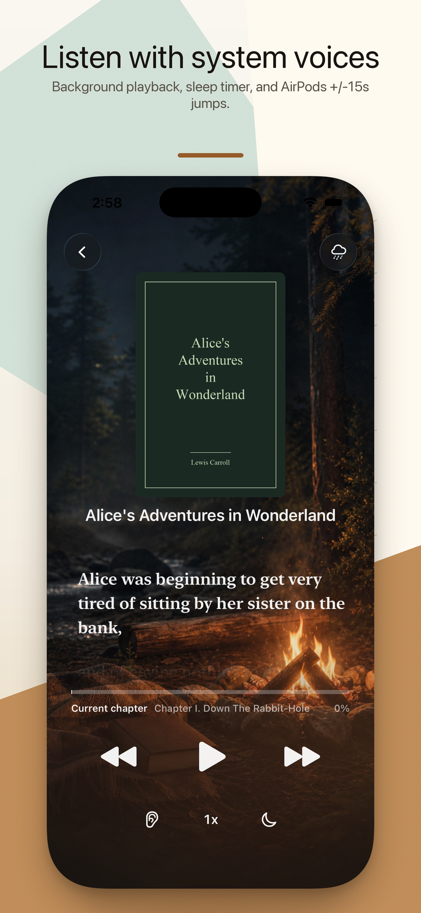
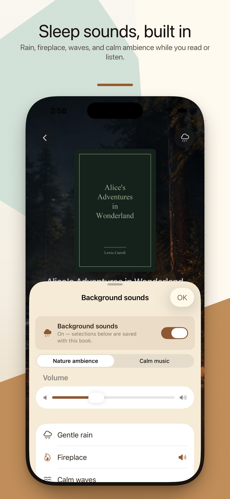

<p align="center">
  
</p>

<h1 align="center">Drowsebook 入梦书</h1>

<p align="center">
  <strong>Your own books, read to you. Then sleep.</strong>
  <br>
  Local reading &amp; bedtime listening · EPUB · PDF · TXT · MOBI · AZW3 · 100% on-device
  <br>
  <a href="https://hooosberg.github.io/DrowseBook/">🌐 Official Website</a>
</p>

<p align="center">
  <a href="README.md">English</a> |
  <a href="i18n/README_zh-Hans.md">简体中文</a> |
  <a href="i18n/README_zh-Hant.md">繁體中文</a> |
  <a href="i18n/README_ja.md">日本語</a>
</p>

<p align="center">
  
  
  
  <br>
  
  
  
</p>

<p align="center">
  <a href="https://hooosberg.github.io/DrowseBook/">
    
    
  </a>
</p>

> 📚 **A quiet iPhone app for the last 30 minutes of your day.** Bring your own EPUB / PDF / TXT / MOBI / AZW3, listen with Apple system voices over rain, fireplace, ocean, or forest ambience, and let the sleep timer fade you out.

**Drowsebook (入梦书)** is a local-first iPhone reader and bedtime-listening companion. You add your own books — five formats, no DRM — and either read them in a calm typographic view or have Apple's built-in voices read them aloud over a soft soundscape. Nothing leaves your device: no account, no analytics, no third-party tracker.

The name **入梦书** ("the book that walks you into a dream") is the whole product brief. Each feature is sized to one quiet session: pick up where you left off, dim the lights, set the timer, drift off.

---

## 🌟 Design philosophy

- **One quiet session at a time** — no streaks, no badges, no social graph, no recommendation feed. Open the app, resume your book, set a timer.
- **Your books, your device** — files you import live in the app sandbox. Uninstall the app and everything goes with it. We never see a filename, let alone a page number.
- **System voices, system polish** — narration uses Apple's built-in TTS voices. No cloud synthesis call, no per-minute quota, no extra subscription. Pair them with sleep-timer fade-out and AirPods double-tap ±15s skip.
- **No subscription, no ads** — bring your own books, listen the way you want, never see an upsell.

---

## ✨ Features

- 🎧 **Bedtime listening with system voices** — Apple's on-device voices read EPUB, PDF, TXT, MOBI, and AZW3 aloud. Position is saved continuously so resuming the next night picks up the exact sentence.
- 🌧 **Soundscapes for drifting off** — Rain, fireplace, ocean, forest, and nature ambience can be layered under the narration. Volumes blend; no network call.
- ⏱ **Sleep timer with fade-out** — 5 / 15 / 30 / 45 / 60 / 90 minutes. The voice and ambience taper off together so the silence at the end doesn't startle you.
- 🎧 **AirPods double-tap ±15s** — Skip back if you drifted off, skip forward if a chapter break is too long. Works with AirPods Pro / Max and most Bluetooth headphones.
- 📖 **Read five local formats** — Native EPUB, PDF, TXT, MOBI, AZW3 import. Bring them in from Files, iCloud Drive, or Safari. DRM-free only.
- 📄 **Smart PDF filtering** — Heuristics drop page numbers, footnote markers, and running headers so the TTS doesn't read them aloud mid-paragraph.
- 🔖 **Bookmarks · auto-resume · outline** — Bookmark anywhere, jump via chapter outline, resume the exact paragraph next time you open the book.
- 🔒 **Private by design** — No account, no analytics SDK, no third-party trackers. App Store privacy label: **"Data Not Collected."**

---

## 📚 Bundled sample books

The app ships with three short public-domain books so you can try every feature without importing anything first:

| File | Title | Author | Language | Source | Length |
|---|---|---|---|---|---|
| `ja-ginga-tetsudo-no-yoru.epub` | 銀河鉄道の夜 | 宮沢賢治 (d. 1933) | 日本語 | 青空文庫 #456 | 9 chapters · 72 KB |
| `zh-qian-zi-wen.epub` | 千字文 | 周興嗣 (d. 521) | 中文 | 中文 Wikisource | 1 chapter · 16 KB |
| `en-alice-in-wonderland.epub` | Alice's Adventures in Wonderland | Lewis Carroll (d. 1898) | English | Project Gutenberg #11 | 12 chapters · 93 KB |

Each was picked for the drowsebook theme: short, classic, dreamy. Together they exercise vertical/horizontal CJK rendering, traditional-Chinese serif, and English literary prose — so you see whether the typography and TTS suit your own library before you spend a cent.

---

## 🔒 Privacy at a glance

| | |
|---|---|
| Personal info | None collected |
| Analytics SDKs | None |
| Third-party trackers | None |
| Network requests | None (entire app is offline; books never leave your device) |
| Permissions requested | None (no notifications, no contacts, no calendar) |
| Storage | App sandbox only — uninstall removes everything |
| Apple privacy label | **Data Not Collected** |

Full text: [**Privacy Policy**](https://hooosberg.github.io/DrowseBook/privacy.html) · [**Terms of Service**](https://hooosberg.github.io/DrowseBook/terms.html)

---

## 🗂 Repository layout

```
.
├── index.html              landing page (GitHub Pages)
├── privacy.html            privacy policy (English, authoritative)
├── terms.html              terms of service (English, authoritative)
├── i18n.js                 site-side i18n + language picker
├── styles.css              site styles
├── icons/                  app icons (1024 master + 8 sizes + 4 rounded)
├── posters/
│   ├── en/                 App Store posters (English)
│   ├── zh-Hans/            Simplified Chinese
│   ├── zh-Hant/            Traditional Chinese
│   └── ja/                 Japanese
└── i18n/                   translated copies of this README
```

This repository hosts only the public website, posters, and policy text. The iOS app source itself is not yet open-sourced.

---

## 🛠 Tech notes

Built in Swift 5 / SwiftUI / SwiftData on iOS 17+. EPUB/MOBI/AZW3 are parsed with hand-rolled streaming parsers (no full-document load — bedtime starts before the spinner finishes). PDF flows through PDFKit with a custom heuristic filter that strips page chrome before handing text to AVSpeechSynthesizer. Soundscapes are seamless AVAudioPlayer loops mixed under the synthesis output, all on-device. StoreKit 2 handles the single non-consumable unlock.

There is no server. Anywhere.

---

## 🌐 Sibling projects

Built by [hooosberg](https://github.com/hooosberg):

- [Rushi 如是](https://hooosberg.github.io/Rushi/) — Diamond Sutra &amp; Heart Sutra · mala beads · meditation soundscapes (free)
- [WitNote](https://hooosberg.github.io/WitNote/) — local-first AI writing companion
- [AgentLimb](https://agentlimb.com) — teach AI to control your browser
- [BeRaw](https://hooosberg.github.io/BeRaw/) — Behance raw-image grabber
- [Packpour](https://hooosberg.github.io/Packpour/) — App Store Connect locale filler
- [GlotShot](https://hooosberg.github.io/GlotShot/) — perfect App Store preview images
- [TrekReel](https://hooosberg.github.io/TrekReel/) — outdoor trails, cinematic reels
- [DOMPrompter](https://hooosberg.github.io/DOMPrompter/) — visualize DOM for AI code
- [UIXskills](https://uixskills.com) — AI → JSON → Whiteboard → UI

---

## 👨‍💻 Developer

**hooosberg**

📧 [zikedece@proton.me](mailto:zikedece@proton.me)

🔗 [https://github.com/hooosberg/DrowseBook](https://github.com/hooosberg/DrowseBook)

🐛 Bug, feature idea, or a book format that doesn't import? Please open an [issue](https://github.com/hooosberg/DrowseBook/issues).

---

<p align="center">
  <i>Your own books, read to you. Then sleep.<br>入梦书</i>
</p>
