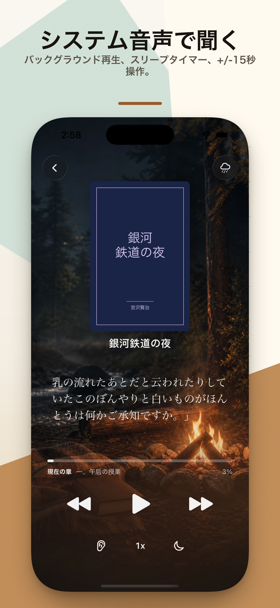
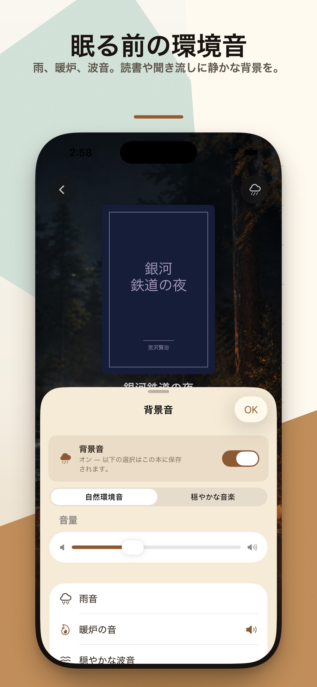

  

<h1 align="center">ドラウズブック Drowsebook</h1>

  <strong>あなたの本を、あなたに読んで、そして眠りへ。</strong>
   
  ローカル読書 &amp; 就寝前リスニング · EPUB · PDF · TXT · MOBI · AZW3 · 100% オンデバイス
   
  <a href="https://hooosberg.github.io/DrowseBook/">🌐 公式サイト</a>

  <a href="../README.md">English</a> |
  <a href="README_zh-Hans.md">简体中文</a> |
  <a href="README_zh-Hant.md">繁體中文</a> |
  <a href="README_ja.md">日本語</a>

  
  
  
   
  
  
  

  

> 📚 **一日の最後の 30 分間のための、静かな iPhone アプリ。** EPUB / PDF / TXT / MOBI / AZW3 を持ち込み、Apple 純正の音声で読み上げ、雨・暖炉・海・森のサウンドスケープを重ね、スリープタイマーで静かにフェードアウト。

**ドラウズブック(Drowsebook)** は、ローカルファーストの iPhone 用リーダー兼就寝前リスニングアプリです。あなたの本を 5 形式・DRM なしで持ち込み、落ち着いたタイポグラフィで読む、もしくは Apple 純正の音声に静かなサウンドスケープを重ねて読み上げてもらう。すべてが端末内で完結 —— アカウント不要、解析なし、サードパーティ追跡なし。

**入梦書/ドラウズブック** という名前そのものが、このアプリの仕様書です。前回の続きから、明かりを落として、タイマーをセットして、夢へ。

---

## 🌟 デザイン哲学

- **一回の静かな読書** —— ストリークも、バッジも、ソーシャルも、レコメンドも、ありません。開いて、続きを読んで、タイマーをセット。
- **あなたの本、あなたの端末** —— インポートしたファイルはアプリのサンドボックスに置かれます。アンインストールで全消去。私たちはファイル名すら見ません。
- **システム音声、システム品質** —— 読み上げは Apple 内蔵 TTS。クラウド呼び出しなし、分単位の制限なし、追加サブスクなし。スリープタイマーのフェードアウト、AirPods ダブルタップ ±15 秒と相性ばっちり。
- **買い切り、ずっと使える** —— $19.99 の一回購入で全機能解放。サブスクも広告も追加課金もなし。

---

## ✨ 機能

- 🎧 **就寝前リスニング、Apple 純正音声** —— EPUB / PDF / TXT / MOBI / AZW3 を読み上げ。位置を常に保存しており、翌晩の続きはその場の一文から。
- 🌧 **眠りに誘うサウンドスケープ** —— 雨、暖炉、海、森、自然環境音を読み上げに重ねられます。音量は独立調整、通信不要。
- ⏱ **スリープタイマー & フェードアウト** —— 5 / 15 / 30 / 45 / 60 / 90 分。音声と環境音が一緒にゆっくりフェードし、突然の無音がありません。
- 🎧 **AirPods ダブルタップ ±15 秒** —— 寝落ち気味なら戻す、聞き慣れた段落なら飛ばす。AirPods Pro / Max とほとんどの Bluetooth ヘッドホンに対応。
- 📖 **ローカル 5 形式** —— EPUB、PDF、TXT、MOBI、AZW3 をネイティブ対応。「ファイル」、iCloud Drive、Safari からインポート。DRM ファイルは非対応。
- 📄 **PDF スマートフィルター** —— ヒューリスティクスでページ番号、脚注マーカー、ヘッダーを除外。読み上げが不要な文字で止まりません。
- 🔖 **しおり · 自動再開 · 目次** —— どこでもしおり、目次から飛び、次に開いた時は段落単位でぴったり戻ります。
- 🔒 **生まれながらにローカル** —— アカウントなし、解析 SDK なし、サードパーティ追跡なし。App Store のプライバシーラベルは **「データを収集しません」**。

---

## 📚 同梱サンプル本

初回起動時に 3 冊のパブリックドメイン作品が自動で本棚に入ります。何もインポートしなくても全機能を試せます:

| ファイル | タイトル | 作者 | 言語 | 出典 | 分量 |
|---|---|---|---|---|---|
| `ja-ginga-tetsudo-no-yoru.epub` | 銀河鉄道の夜 | 宮沢賢治 (1933 没) | 日本語 | 青空文庫 #456 | 9 章 · 72 KB |
| `zh-qian-zi-wen.epub` | 千字文 | 周興嗣 (521 没) | 中国語(繁体) | 中文 Wikisource | 1 章 · 16 KB |
| `en-alice-in-wonderland.epub` | Alice's Adventures in Wonderland | Lewis Carroll (1898 没) | 英語 | Project Gutenberg #11 | 12 章 · 93 KB |

3 冊とも「眠りへ」というテーマに沿った、短く、古典、夢のような物語。縦書き日本語、繁体中国語の韻文、英語の文学散文を一通り試せるので、お金を払う前に「自分の本棚に合う組版と音声か」を確かめられます。

---

## 🔒 プライバシー一覧

| | |
|---|---|
| 個人情報 | 一切収集しません |
| 解析 SDK | なし |
| サードパーティ追跡 | なし |
| ネットワーク通信 | なし(完全オフライン動作。本が端末を離れることはありません) |
| 要求する権限 | なし(通知も連絡先もカレンダーも不要) |
| データ保存 | アプリのサンドボックスのみ —— アンインストールで全消去 |
| Apple プライバシーラベル | **データを収集しません** |

全文:[**プライバシーポリシー**](https://hooosberg.github.io/DrowseBook/privacy.html) · [**利用規約**](https://hooosberg.github.io/DrowseBook/terms.html)

---

## 👨‍💻 開発者

**hooosberg**

📧 [zikedece@proton.me](mailto:zikedece@proton.me)

🔗 [https://github.com/hooosberg/DrowseBook](https://github.com/hooosberg/DrowseBook)

🐛 バグ報告、機能リクエスト、特定形式のインポート失敗などは [issue](https://github.com/hooosberg/DrowseBook/issues) へどうぞ。

---

  <i>あなたの本を、あなたに読んで、そして眠りへ。 入梦书</i>

