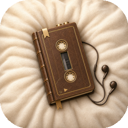
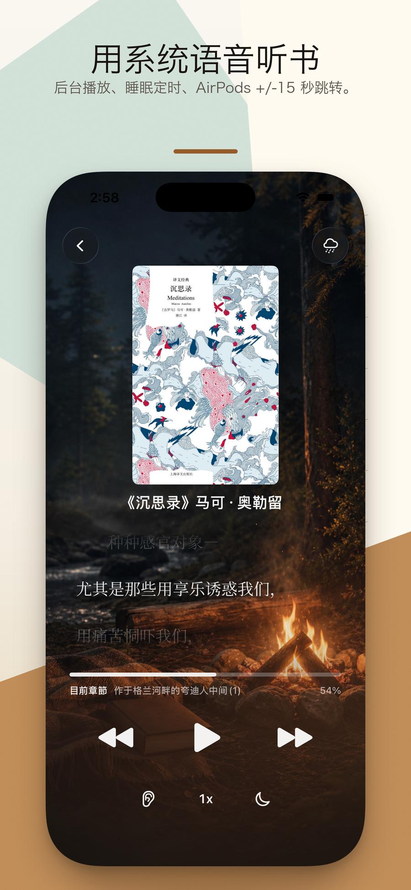
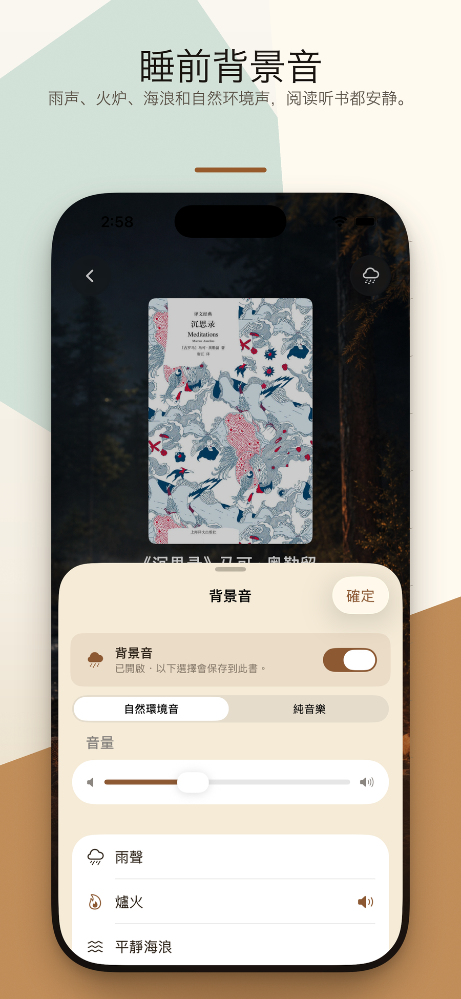

  

<h1 align="center">入梦书 Drowsebook</h1>

  <strong>把你自己的书读给你听,再入睡。</strong>
   
  本地阅读 &amp; 睡前听读 · EPUB · PDF · TXT · MOBI · AZW3 · 100% 本机
   
  <a href="https://hooosberg.github.io/DrowseBook/">🌐 官方网站</a>

  <a href="../README.md">English</a> |
  <a href="README_zh-Hans.md">简体中文</a> |
  <a href="README_zh-Hant.md">繁體中文</a> |
  <a href="README_ja.md">日本語</a>

  
  
  
   
  
  
  

  

> 📚 **为一天最后 30 分钟设计的一款安静的 iPhone 应用。** 导入你自己的 EPUB / PDF / TXT / MOBI / AZW3,用 Apple 系统朗读人声配上雨声、壁炉、海浪、森林等环境音,让睡眠定时把你慢慢淡出。

**入梦书(Drowsebook)** 是一款本地优先的 iPhone 阅读与睡前听读应用。你导入自己的书 —— 五种格式、不带 DRM —— 既可以在排版舒适的阅读视图里读,也可以让 Apple 系统人声把它念出来,配以柔和的音景。所有内容都不离开你的设备:不开账号、不接埋点、不接第三方追踪。

**入梦书** 这个名字就是产品的全部目标说明书。每个功能都按"一次安静的阅读"来打磨:翻到上次读到的地方、调暗灯光、定时入睡。

---

## 🌟 设计理念

- **一次安静的阅读** —— 没有连击、没有徽章、没有社交、没有推荐流。打开应用、续读、定时。
- **你的书,你的设备** —— 导入的文件保存在应用沙盒里,卸载即清除。我们永远看不到文件名,更看不到你读到第几页。
- **系统人声,系统级体验** —— 朗读用的是 Apple 内置 TTS 人声,不走云端、不限分钟、不再额外订阅。配合睡眠定时淡出、AirPods 双击 ±15 秒,刚刚好。
- **不订阅、无广告** —— 用自己的书、按自己的方式听,不会被任何加购窗口打断。

---

## ✨ 功能

- 🎧 **睡前听读,Apple 系统人声** —— Apple 设备内置的 TTS 朗读 EPUB / PDF / TXT / MOBI / AZW3。位置实时保存,第二晚续读直接落到上次的那一句。
- 🌧 **入睡音景** —— 雨声、壁炉、海浪、森林、自然环境音可与朗读叠加播放,音量独立,无需联网。
- ⏱ **睡眠定时与淡出** —— 5 / 15 / 30 / 45 / 60 / 90 分钟。人声与环境音一起缓慢淡出,不会突然安静。
- 🎧 **AirPods 双击 ±15 秒** —— 走神了倒回去,听到耳熟的段落往前跳。AirPods Pro / Max 以及多数蓝牙耳机均支持。
- 📖 **本地五种格式** —— 原生支持 EPUB、PDF、TXT、MOBI、AZW3。从"文件"、iCloud Drive、Safari 导入。仅支持无 DRM 文件。
- 📄 **PDF 智能过滤** —— 启发式规则过滤页码、脚注标记、页眉,朗读时不会被多余字符打断。
- 🔖 **书签 · 自动续读 · 章节大纲** —— 任意位置加书签,通过大纲跳转,下一次打开自动回到原段落。
- 🔒 **天生本地** —— 不开账号、无埋点 SDK、无第三方追踪。App Store 隐私标签:**不收集任何数据**。

---

## 📚 内置示例书

应用首次启动会自动入库三本短篇公有领域作品,让你不用导入也能试遍所有功能:

| 文件 | 标题 | 作者 | 语言 | 来源 | 体量 |
|---|---|---|---|---|---|
| `ja-ginga-tetsudo-no-yoru.epub` | 銀河鉄道の夜 | 宮沢賢治 (1933 逝) | 日本語 | 青空文庫 #456 | 9 章 · 72 KB |
| `zh-qian-zi-wen.epub` | 千字文 | 周興嗣 (521 逝) | 繁体中文 | 中文 Wikisource | 1 章 · 16 KB |
| `en-alice-in-wonderland.epub` | Alice's Adventures in Wonderland | Lewis Carroll (1898 逝) | 英文 | Project Gutenberg #11 | 12 章 · 93 KB |

三本书契合"入梦"主题 —— 短、经典、有梦意。一并涵盖竖横排日文、繁体中文小篆字、英文衬线散文,让你在花一分钱之前就先看清自家书库会不会被这套排版与朗读照顾好。

---

## 🔒 隐私一眼可见

| | |
|---|---|
| 个人信息 | 完全不收集 |
| 分析 SDK | 无 |
| 第三方追踪 | 无 |
| 网络请求 | 无(完全离线运行,书永远不离开你的设备) |
| 申请的权限 | 无(不要通知、不要通讯录、不要日历) |
| 数据存储 | 仅在应用沙盒内 —— 卸载即清空 |
| Apple 隐私标签 | **不收集任何数据** |

完整条款:[**隐私政策**](https://hooosberg.github.io/DrowseBook/privacy.html) · [**服务条款**](https://hooosberg.github.io/DrowseBook/terms.html)

---

## 👨‍💻 开发者

**hooosberg**

📧 [zikedece@proton.me](mailto:zikedece@proton.me)

🔗 [https://github.com/hooosberg/DrowseBook](https://github.com/hooosberg/DrowseBook)

🐛 发现 bug、想要新功能、或者某种格式导入失败?请到 [issue 区](https://github.com/hooosberg/DrowseBook/issues) 反馈。

---

  <i>把你自己的书读给你听,再入睡。 入梦书</i>

