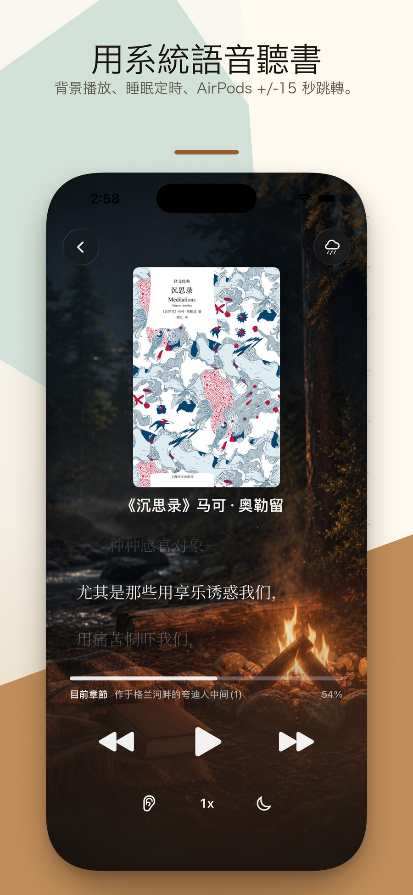
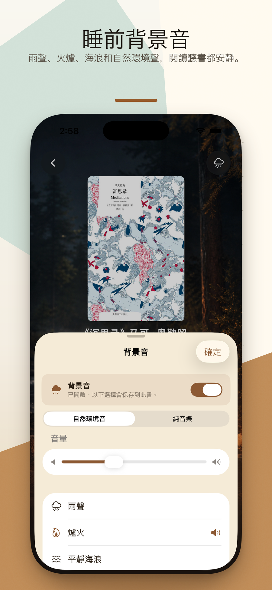

  

<h1 align="center">入夢書 Drowsebook</h1>

  <strong>把你自己的書讀給你聽,然後入睡。</strong>
   
  本地閱讀 &amp; 睡前聽讀 · EPUB · PDF · TXT · MOBI · AZW3 · 100% 在裝置上
   
  <a href="https://hooosberg.github.io/DrowseBook/">🌐 官方網站</a>

  <a href="../README.md">English</a> |
  <a href="README_zh-Hans.md">简体中文</a> |
  <a href="README_zh-Hant.md">繁體中文</a> |
  <a href="README_ja.md">日本語</a>

  
  
  
   
  
  
  

  

> 📚 **為一天最後 30 分鐘設計的安靜 iPhone App。** 匯入你自己的 EPUB / PDF / TXT / MOBI / AZW3,讓 Apple 系統朗讀人聲在雨聲、壁爐、海浪、森林等環境音的襯墊下把書唸給你聽,睡眠定時會把你慢慢淡出。

**入夢書(Drowsebook)** 是一款本地優先的 iPhone 閱讀與睡前聽讀 App。你自己的書 —— 五種格式、不含 DRM —— 可以在排版舒適的閱讀畫面裡讀,也可以讓 Apple 系統人聲把它念出來,配上柔和的音景。所有內容不離開你的裝置:不開帳號、不接埋點、不接第三方追蹤。

**入夢書** 這個名字本身就是這款 App 的全部目標。每個功能都針對「一次安靜的閱讀」設計:接上次的進度、調暗光線、定時、入睡。

---

## 🌟 設計理念

- **一次安靜的閱讀** —— 沒有連勝、沒有徽章、沒有社群、沒有推薦動態。打開 App、續讀、定時。
- **你的書,你的裝置** —— 匯入的檔案保留在 App 沙盒內,移除 App 即一併清除。我們永遠看不到檔名,更看不到你讀到第幾頁。
- **系統人聲,系統級體驗** —— 朗讀使用 Apple 內建 TTS 人聲。不走雲端、不限分鐘、不另外訂閱。配合睡眠定時淡出與 AirPods 雙擊 ±15 秒。
- **一次買斷,永久使用** —— 一次性 $19.99 內購解鎖完整功能。不訂閱、無廣告、無加購。

---

## ✨ 功能

- 🎧 **睡前聽讀,Apple 系統人聲** —— Apple 裝置內建的 TTS 朗讀 EPUB / PDF / TXT / MOBI / AZW3。位置即時保存,隔天續讀直接定位到上次那一句。
- 🌧 **入睡音景** —— 雨聲、壁爐、海浪、森林、自然環境音可疊加在朗讀之下,音量獨立,無需連網。
- ⏱ **睡眠定時與淡出** —— 5 / 15 / 30 / 45 / 60 / 90 分鐘。人聲與環境音一起緩慢淡出,結尾不會突然寂靜。
- 🎧 **AirPods 雙擊 ±15 秒** —— 走神了倒回去,聽到熟段落往前跳。AirPods Pro / Max 與多數藍牙耳機都支援。
- 📖 **本地五種格式** —— 原生支援 EPUB、PDF、TXT、MOBI、AZW3。可從「檔案」、iCloud 雲碟、Safari 匯入。僅支援無 DRM 檔案。
- 📄 **PDF 智慧過濾** —— 啟發式規則去除頁碼、注腳標記、頁眉,朗讀時不會被多餘字元打斷。
- 🔖 **書籤 · 自動續讀 · 章節大綱** —— 任何位置加書籤,經大綱跳轉,下次開啟自動回到原段落。
- 🔒 **天生本地** —— 不開帳號、無埋點 SDK、無第三方追蹤。App Store 隱私標籤:**不收集任何資料**。

---

## 📚 內建範例書

App 首次啟動會自動入庫三本短篇公有領域作品,不必匯入也能試遍所有功能:

| 檔案 | 標題 | 作者 | 語言 | 來源 | 體量 |
|---|---|---|---|---|---|
| `ja-ginga-tetsudo-no-yoru.epub` | 銀河鉄道の夜 | 宮沢賢治 (1933 歿) | 日本語 | 青空文庫 #456 | 9 章 · 72 KB |
| `zh-qian-zi-wen.epub` | 千字文 | 周興嗣 (521 歿) | 繁體中文 | 中文 Wikisource | 1 章 · 16 KB |
| `en-alice-in-wonderland.epub` | Alice's Adventures in Wonderland | Lewis Carroll (1898 歿) | 英文 | Project Gutenberg #11 | 12 章 · 93 KB |

三本書貼合「入夢」主題 —— 短、經典、帶夢意。一併測試直橫排日文、繁體中文古典韻文、英文襯線散文,讓你在花一毛錢之前就看清這套排版與朗讀是否適合自己的書庫。

---

## 🔒 隱私一覽

| | |
|---|---|
| 個人資料 | 完全不收集 |
| 分析 SDK | 無 |
| 第三方追蹤 | 無 |
| 網路請求 | 無(完全離線執行,書永遠不離開你的裝置) |
| 申請的權限 | 無(不要通知、不要通訊錄、不要日曆) |
| 資料儲存 | 僅在 App 沙盒內 —— 移除即清空 |
| Apple 隱私標籤 | **不收集任何資料** |

完整條款:[**隱私政策**](https://hooosberg.github.io/DrowseBook/privacy.html) · [**服務條款**](https://hooosberg.github.io/DrowseBook/terms.html)

---

## 👨‍💻 開發者

**hooosberg**

📧 [zikedece@proton.me](mailto:zikedece@proton.me)

🔗 [https://github.com/hooosberg/DrowseBook](https://github.com/hooosberg/DrowseBook)

🐛 發現 bug、想要新功能,或某種格式匯入失敗?歡迎到 [issue 區](https://github.com/hooosberg/DrowseBook/issues) 留言。

---

  <i>把你自己的書讀給你聽,然後入睡。 入夢書</i>

